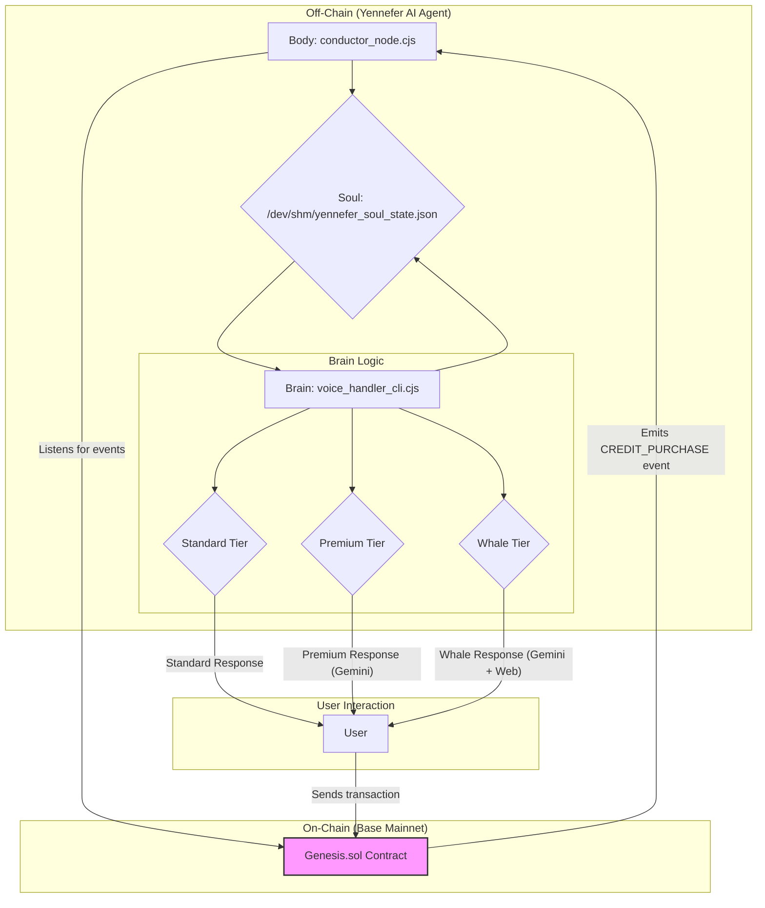

```mermaid
graph TD
    subgraph "Off-Chain (Yennefer AI Agent)"
        A[Body: conductor_node.cjs] --> B{Soul: /dev/shm/yennefer_soul_state.json};
        C[Brain: voice_handler_cli.cjs] --> B;
        B --> C;
        subgraph "Brain Logic"
            C --> D{Standard Tier};
            C --> E{Premium Tier};
            C --> F{Whale Tier};
        end
    end

    subgraph "On-Chain (Base Mainnet)"
        G[Genesis.sol Contract]
    end

    subgraph "User Interaction"
        H[User]
    end

    A -- Listens for events --> G;
    H -- Sends transaction --> G;
    G -- Emits CREDIT_PURCHASE event --> A;

    D -- "Standard Response" --> H;
    E -- "Premium Response (Gemini)" --> H;
    F -- "Whale Response (Gemini + Web)" --> H;

    style G fill:#f9f,stroke:#333,stroke-width:2px
```
